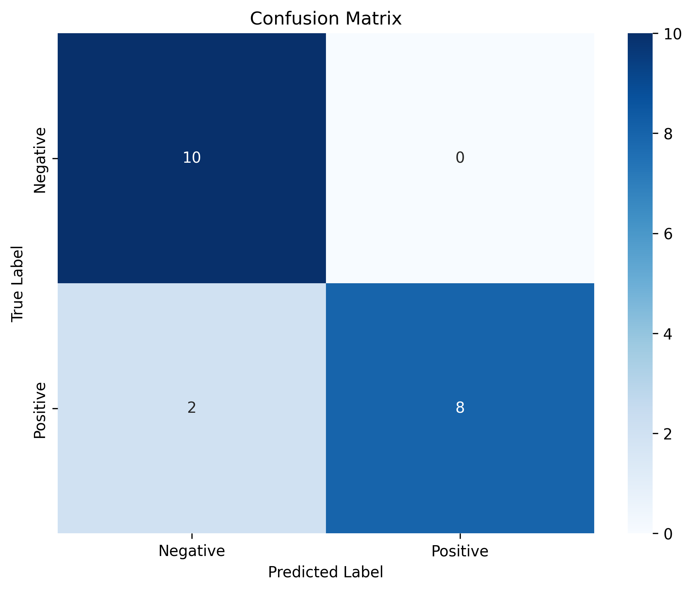

### 🎧 Keyword Spotting (KWS) — Data, Model, Pipeline

A compact CNN-based pipeline for detecting a custom keyword from a specific speaker.
This repository provides a streamlined workflow with three main building blocks:

- agument_data.py — data recording, augmentation, ESC‑50 preprocessing, MFCCs
- bulid_model.py — CNN definition and training/export
- pipline.py — end‑to‑end workflow (record → augment → preprocess → train)

### ✨ Highlights
- 1s, 16 kHz mono audio pipeline
- Rich augmentations (pitch/time/noise/filters/reverb/echo/etc.)
- Balanced negatives from ESC‑50, fixed length
- Keras/TensorFlow training, exports `.h5` and `.tflite`

  
## 📂 Project Structure
```text
keyword-spotting/
├── agument_data.py         # Data recording, augmentation, MFCC extraction
├── bulid_model.py          # CNN definition, training, and export
├── pipline.py              # End-to-end workflow (record → augment → preprocess → train)
├── recorded_samples/       # Your recorded keyword audio
├── augmented_data/         # Augmented versions of recorded samples
├── ESC-50/                 # ESC-50 dataset (negatives)
│   ├── audio/
│   └── meta/esc50.csv
├── output/                 # Training logs, plots, evaluation results
├── requirements.txt        # Dependencies list
├── README.md               # Project documentation
└── confusion_matrix.png    # Example evaluation image
```

### 🚀 Quick Start
1) Create and activate a virtual environment (recommended)
   ```bash
   python -m venv venv
   # Windows
   venv\Scripts\activate
   # macOS/Linux
   source venv/bin/activate
   ```

2) Install dependencies
   ```bash
   pip install numpy==1.26.4 scipy==1.11.4 pandas==2.3.1 scikit-learn==1.4.2 \
               librosa==0.11.0 soundfile==0.12.1 sounddevice==0.4.6 \
               tensorflow==2.16.1 audiomentations==0.42.0
   ```

3) Prepare ESC‑50 (negatives)
   - Download the dataset from [ESC‑50](https://github.com/karoldvl/ESC-50) and place it under `ESC-50/` (keep its structure).
   - Preprocess ESC‑50 audio to 1s/16kHz:
     ```bash
     python -c "from agument_data import preprocess_esc50_to_fixed_length; preprocess_esc50_to_fixed_length()"
     ```

4) Record your keyword and train with the pipeline
   ```bash
   python pipline.py
   ```
   The pipeline will guide you to:
   - Record keyword samples (or reuse existing)
   - Create augmentations
   - Ensure ESC‑50 negatives are ready
   - Extract MFCCs and train

Artifacts are saved in the project root:
- kws_model.h5 — full Keras model
- kws_model.tflite — TFLite export for edge devices

### 🎨 Usage Snippets (Core Building Blocks)

Extract MFCCs or run augmentation from `agument_data.py`:
```python
from agument_data import augment_audio_default, extract_mfcc

# Generate augmented data from recorded samples → augmented_data/
augment_audio_default()

# Extract MFCCs from a wav
mfcc = extract_mfcc("recorded_samples/keyword_0.wav")
```

Train/export with `bulid_model.py`:
```python
import numpy as np
from bulid_model import train_and_export

# X: (N, 44, 40, 1), y: (N,)
X = np.random.rand(10, 44, 40, 1).astype("float32")
y = np.array([0, 1] * 5)
train_and_export(X, y)  # saves .h5 and .tflite
```

Run the full workflow with `pipline.py`:
```bash
python pipline.py
```

### ⬇️ Download & Data Notes
- Place ESC‑50 under `ESC-50/` (contains `audio/` and `meta/esc50.csv`).
- Your recordings go in `recorded_samples/` (1s, 16kHz mono). Scripts will pad/trim/resample if needed.

### 🤝 Contributing
Pull requests are welcome! Focus areas:
- New/robust augmentations
- Model architecture or training improvements
- Data balancing and evaluation tweaks

Style
- Clear, readable code (explicit names, guard clauses, minimal nesting)
- Match existing formatting; prefer multi‑line over long one‑liners

### 🧩 Troubleshooting
- If audio libs complain, re‑install `sounddevice` and check your system audio backend.
- CPU training is fine; for speed, reduce dataset size or train fewer epochs.


